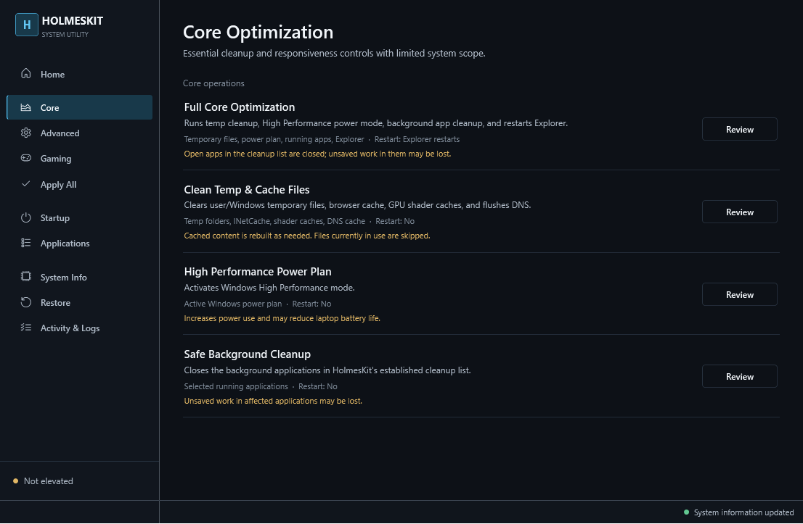

# HolmesKit

HolmesKit is a transparent, confirmation-based Windows optimization toolkit with two supported interfaces:

- **Desktop application:** `HolmesKit.exe`, a native Windows interface for reviewing, applying, and restoring changes.
- **CLI:** `HolmesKit.bat`, the original standalone Batch/PowerShell menu.

Both interfaces use the same HolmesKit operations. The desktop application calls the established Batch entry points rather than maintaining a separate set of Windows modifications, and the CLI remains fully usable without the GUI.

> HolmesKit changes Windows configuration. Save open work, review each confirmation, and keep a current backup. No performance outcome is guaranteed on every system.

## Functionality

| Area | CLI | Desktop | Restore path |
|---|---:|---:|---:|
| Core / Advanced / Gaming operations | Yes | Yes | Component restore options |
| Apply All | Yes | Yes | Restore page |
| System information | Yes | Yes | N/A |
| Startup Manager | Yes | Yes | Toggle again |
| Applications Manager | Yes | Yes | Application-specific |
| Session/action logs | Yes | Yes | N/A |

The GUI shows scope, tradeoffs, and restart guidance before each optimization. Long-running commands run away from the UI thread, stream visible activity, support safe cancellation, and are judged by exit status rather than process launch alone.

## Requirements

- Windows 10 or Windows 11, x64
- Administrator access for system operations
- Windows PowerShell 5.1
- For source builds: [.NET 10 SDK](https://dotnet.microsoft.com/download/dotnet/10.0)

The published desktop app can be self-contained, so end users do not need to install .NET.

## Use the CLI

The CLI remains independent of the GUI:

1. Clone or download the repository.
2. Right-click `HolmesKit.bat` and select **Run as administrator**.
3. Review the startup safety notice and every operation confirmation.

Nothing in the CLI requires `HolmesKit.exe` or the .NET SDK. The Batch file also has a validated non-interactive entry point used by the desktop app: `HolmesKit.bat --run core-full`. Normal CLI use retains all interactive menus.

## Desktop application

The desktop application is a lightweight C#/WPF frontend for Windows 10 and Windows 11. It starts with administrator privileges because optimization and restore operations modify protected system configuration. Read-only data is collected in the background so the interface remains responsive.

The interface includes:

- **Home** — system, power-plan, backup, and recent-activity summary
- **Core Optimization**, **Advanced Tweaks**, and **Gaming Mode** — operation groups with scope, restart guidance, and tradeoffs
- **Apply All** — the complete existing HolmesKit sequence with one confirmation
- **Startup Manager** — enabled-state management without deleting entries
- **Applications Manager** — installed-program metadata and registered uninstallers
- **System Information** — Windows, processor, memory, power, storage, and active-network details
- **Restore** — validated backup restoration and Windows-default recovery actions
- **Activity & Logs** — live command progress and the persistent audit log



### Run a published build

Keep this distribution layout together:

```text
HolmesKit.exe
HolmesKit.bat
modules/
  gui_bridge.ps1
  ...
```

Launch `HolmesKit.exe` from the published folder. Windows requests administrator approval at startup. If UAC is declined, Windows cancels startup without making changes.

Do not copy only the executable: the adjacent Batch file and `modules` directory are the shared HolmesKit engine.

## Build and test

From PowerShell in the repository root:

```powershell
dotnet restore HolmesKit.slnx
dotnet build HolmesKit.slnx -c Release
dotnet test HolmesKit.slnx -c Release --no-build
```

Run the source-built application with:

```powershell
dotnet run --project src\HolmesKit.Desktop\HolmesKit.Desktop.csproj -c Release
```

## Publish a portable folder

```powershell
dotnet publish src\HolmesKit.Desktop\HolmesKit.Desktop.csproj -c Release -r win-x64 --self-contained true -o artifacts\publish\win-x64
```

The app is emitted as one managed executable, while `HolmesKit.bat` and `modules/` remain adjacent engine files by design. Copy the entire publish folder, not only the executable.

## Backup and restore

Before optimization, HolmesKit creates its latest backup under `HolmesKit_Backups\latest`. The desktop application verifies that every expected registry key has either a valid export or an explicit absent-key record before it enables registry restoration. An unrelated or partial file is not shown as a valid backup. Activity is appended to `HolmesKit_Backups\holmeskit.log`; all local machine state is excluded from Git.

The Restore page exposes the same registry, power, service, hibernation, network, and Explorer actions as the CLI. Deleted temporary files are not recoverable, closed applications must be reopened, and third-party uninstall rollback belongs to that application's installer.

## Safety notes

- Temp cleanup skips in-use files, but deleted cache/temp content is not backed up.
- Background cleanup force-closes the established app list; save work first.
- High Performance mode increases energy use.
- Disabling Windows Search stops live indexing.
- Disabling hibernation can also affect Fast Startup.
- Network operations can interrupt connectivity and may require a restart.
- Startup Manager changes enabled state and never deletes entries.
- Applications Manager launches the uninstaller registered with Windows.

## Troubleshooting

- **Missing script:** keep `HolmesKit.exe`, `HolmesKit.bat`, and `modules/` in the layout above.
- **PowerShell missing:** restore Windows PowerShell 5.1. The GUI reports the launch failure.
- **Access denied/UAC declined:** relaunch and approve the Windows prompt when ready.
- **Operation failure:** inspect **Activity & Logs** and `HolmesKit_Backups\holmeskit.log`.
- **Network issue:** use **Restore → Reset Network Defaults**, then restart Windows.
- **Search unavailable:** use **Restore → Re-enable Background Services**.

## Architecture

```text
                         HolmesKit operations
                         HolmesKit.bat labels
                                  |
                 +----------------+----------------+
                 |                                 |
       interactive CLI menus             --run dispatcher
          HolmesKit.bat                          |
                                          async WPF service
                                                 |
                                           HolmesKit.exe
```

`HolmesKitCommandService` is the GUI's single process boundary. It captures stdout, stderr, exit codes, progress lines, and cancellation. `gui_bridge.ps1` provides structured read/toggle/uninstall data for native tables while preserving the existing registry/task/uninstaller safety model.

System information crosses the PowerShell boundary as JSON with raw byte counts, nullable measurements, uptime seconds, and explicit power-plan metadata. Formatting is handled by the desktop presentation layer so locale differences or unavailable values do not become misleading zeroes. Custom power-plan names are retained and identified as custom plans.

See [the feature-parity audit](docs/feature-parity.md) for the source-derived operation inventory.

## Repository structure

```text
HolmesKit.bat                     CLI and shared optimization engine
modules/                          CLI modules and GUI data bridge
src/HolmesKit.Desktop/            WPF desktop application
tests/HolmesKit.Desktop.Tests/    safe tests
docs/                             audit and architecture notes
docs/screenshots/                 representative desktop screenshot
HolmesKit_Backups/                generated local state (ignored)
```

## Known limitations

- The desktop publish target is Windows x64.
- Privileged integration behavior must be validated on a disposable Windows test machine; automated tests never alter registry, services, networking, power plans, or installed applications.
- HolmesKit retains the original latest-backup model rather than backup history.
- Application sizes come from optional Windows uninstall-registry estimates. Missing values are shown as unavailable, and reported sizes may differ from actual disk usage.
- CPU utilization is an on-demand Windows snapshot rather than continuous monitoring.
- Windows editions and organization policies can reject individual service, TCP, power, or registry commands. Diagnostics remain visible and logged.
